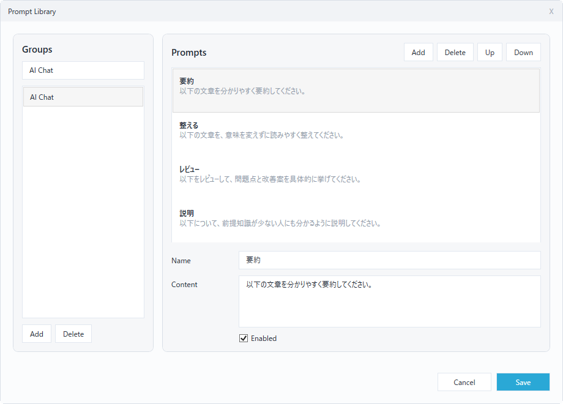
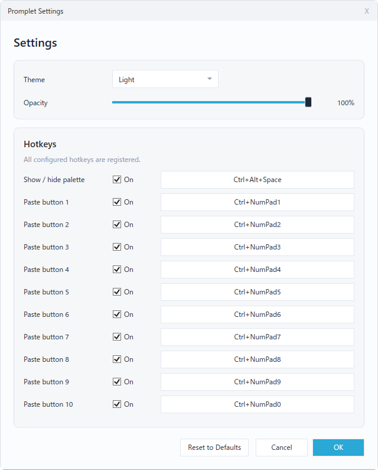

# Promplet

Promplet is a tray-resident Windows prompt palette for quickly pasting reusable text into AI chats, CLI tools, terminals, Slack, email, and other text inputs.

Version: 1.0.0

## What It Does

Promplet keeps a small, always-on-top palette on screen. Each button represents one reusable prompt. Clicking a button pastes that prompt into the application that had focus before the palette was clicked.

The palette is designed to stay out of the way:

- It does not appear in the taskbar.
- The `X` button hides the palette instead of exiting the app.
- The tray icon menu is the main place for settings, Prompt Library, reload, and exit.
- Only one Promplet instance can run at a time. Starting Promplet again while it is already running exits the second process before it creates another tray icon or hotkey registration.

## Screenshots

Main palette:


Prompt Library:



Settings:



## Install

There is no installer for the current release. Download the release zip, extract it, and run `Promplet.exe`.

1. Open the [latest release](https://github.com/isshiki/Promplet/releases/latest).
2. Download `Promplet-v1.0.0-win-x64.zip` from the release assets.
3. Extract the zip.
4. Move the extracted folder to a stable location.
5. Run `Promplet.exe`.

The `v1.0.0` part of the zip filename changes with each release. For future versions, download the latest `Promplet-vX.Y.Z-win-x64.zip` asset.

Recommended install locations are:

- `%LOCALAPPDATA%\Programs\Promplet`
- A tools folder you already back up or sync
- A portable apps folder

The release zip contains a self-contained Windows x64 build. No separate .NET runtime install is required.

For normal use, `Promplet.exe` is the only file required to run the app. For redistribution, keep the `LICENSE` file alongside `Promplet.exe`, or distribute the release zip as-is.

Do not use `Source code (zip)` or `Source code (tar.gz)` from the release page when you only want to run Promplet. Those files are GitHub's automatic source-code archives and do not contain the ready-to-run app.

## Run and Exit

Double-click `Promplet.exe` to start it.

Use the tray icon menu to:

- Show or hide the palette
- Open Prompt Library
- Open Settings
- Reload prompt data from disk
- Exit Promplet

Use the palette `X` button when you only want to hide the palette. Use the tray menu `Exit` command when you want to fully stop Promplet.

## Default Hotkeys

- `Ctrl+Alt+Space`: show or hide the palette
- `Ctrl+NumPad1` ... `Ctrl+NumPad9`: paste visible buttons 1-9
- `Ctrl+NumPad0`: paste visible button 10

NumPad shortcuts depend on how Windows reports the physical numpad key. Keep NumLock on. Avoid adding `Shift` to numpad shortcuts because Windows may stop reporting the key as `NumPad`.

Hotkeys can be changed in Settings. If Windows rejects a shortcut because another app already owns it, Settings shows the registration failure.

## Palette

The main palette shows the prompts in the selected group.

- Groups are shown as tabs at the top.
- Prompt buttons are stacked vertically.
- The palette height follows the number of visible prompt buttons automatically.
- The palette width can be resized from the left or right edge.
- Right-clicking a prompt button copies the prompt text without pasting.

The default prompts are examples. Edit them in Prompt Library.

## Prompt Library

Open Prompt Library from the tray icon menu.

Prompt Library manages groups and prompt buttons:

- Add and delete groups
- Rename groups
- Add and delete prompts
- Rename prompts
- Edit prompt text
- Enable or disable prompts
- Move prompts up or down
- Save or cancel changes

Promplet supports up to 10 groups. Each group supports up to 10 prompt buttons, matching the default `Ctrl+NumPad1` through `Ctrl+NumPad0` hotkeys.

## Settings

Open Settings from the tray icon menu.

Settings supports:

- Theme mode: System, Light, or Dark
- Palette opacity
- Show/hide palette hotkey
- Paste button hotkeys
- Reset to defaults

Theme and opacity changes are previewed while the dialog is open. `OK` saves changes. `Cancel` restores the previous settings.

## Data File

Prompts and app settings are stored in:

```text
%APPDATA%\Promplet\prompts.json
```

Promplet creates this file automatically on first launch.

If the JSON file is invalid, Promplet backs it up with a `.bak` suffix and recreates a valid default file.

To reset Promplet to the default prompts and settings:

1. Exit Promplet from the tray icon menu.
2. Delete `%APPDATA%\Promplet\prompts.json`.
3. Start Promplet again.

## Build From Source

Use this section only if you want to build Promplet yourself.

Requirements:

- Windows
- .NET 10 SDK
- Visual Studio 18 or later with WPF desktop development, if you want to open the solution in Visual Studio

Build for development:

```powershell
dotnet build .\Promplet.slnx
```

Publish the v1.0 single-file Windows x64 executable:

```powershell
dotnet publish .\Promplet\Promplet.csproj `
  --configuration Release `
  --runtime win-x64 `
  --self-contained true `
  -p:PublishSingleFile=true `
  -p:IncludeNativeLibrariesForSelfExtract=true `
  -p:DebugType=None `
  -p:DebugSymbols=false `
  --output .\artifacts\Promplet-1.0.0-win-x64
```

The publish output should contain `Promplet.exe`.

The published exe is much larger than the normal build exe because it contains the required .NET runtime components. That size difference is expected.

The development build output under `Promplet\bin\Release\net10.0-windows` is framework-dependent. It must stay together with the generated `.dll`, `.deps.json`, `.runtimeconfig.json`, and related files, and it requires the matching .NET Desktop Runtime to be installed.

## Test

```powershell
dotnet run --project .\Promplet.Tests\Promplet.Tests.csproj
```

## License

Promplet is licensed under the Apache License, Version 2.0. See [LICENSE](LICENSE).
